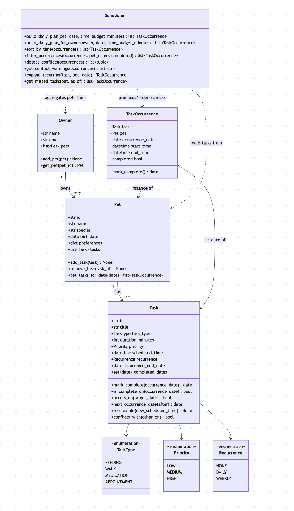

# PawPal+ (Module 2 Project)

You are building **PawPal+**, a Streamlit app that helps a pet owner plan care tasks for their pet.

## Scenario

A busy pet owner needs help staying consistent with pet care. They want an assistant that can:

- Track pet care tasks (walks, feeding, meds, enrichment, grooming, etc.)
- Consider constraints (time available, priority, owner preferences)
- Produce a daily plan and explain why it chose that plan

Your job is to design the system first (UML), then implement the logic in Python, then connect it to the Streamlit UI.

## ✨ Features

- **Priority-first daily planning** — `Scheduler.build_daily_plan()` / `build_daily_plan_for_owner()` order tasks by priority (HIGH → LOW), chronologically by start time as a deterministic tie-break within a priority tier, and (optionally) truncate the plan to fit a `time_budget_minutes` window.
- **Sorting by time** — `Scheduler.sort_by_time()` gives a plain chronological "what happens when" view, as an alternative to the priority-first plan.
- **Conflict warnings** — `Scheduler.detect_conflicts()` / `get_conflict_warnings()` flag two tasks whose time windows *strictly* overlap (back-to-back tasks that merely touch are not a conflict), across every pet an owner has, and produce ready-to-display warning strings.
- **Daily & weekly recurrence** — `Task.occurs_on()` / `next_occurrence_date()` expand a single `Task` template into dated occurrences on demand (respecting an optional `recurrence_end_date` and midnight-rollover tasks that span two days), so recurring tasks don't need to be duplicated in storage.
- **Per-date completion tracking** — completing one occurrence of a recurring task (e.g. today's walk) doesn't silently mark the entire series done.
- **Filtering** — `Scheduler.filter_occurrences()` narrows a plan by pet name and/or completion status.
- **Missed-task recovery** — `Scheduler.get_missed_tasks()` surfaces overdue, uncompleted occurrences so they can be rescheduled via `Task.reschedule()` instead of silently vanishing.
- **Next available slot** — `Scheduler.find_next_available_slot()` finds the earliest free window of a given length on a given date within an optional `earliest`/`latest` bound, correctly collapsing overlapping busy windows instead of stopping at the first one's end.

## What you will build

Your final app should:

- Let a user enter basic owner + pet info
- Let a user add/edit tasks (duration + priority at minimum)
- Generate a daily schedule/plan based on constraints and priorities
- Display the plan clearly (and ideally explain the reasoning)
- Include tests for the most important scheduling behaviors

## Getting started

### Setup

```bash
python -m venv .venv
source .venv/bin/activate  # Windows: .venv\Scripts\activate
pip install -r requirements.txt
```

### Suggested workflow

1. Read the scenario carefully and identify requirements and edge cases.
2. Draft a UML diagram (classes, attributes, methods, relationships).
3. Convert UML into Python class stubs (no logic yet).
4. Implement scheduling logic in small increments.
5. Add tests to verify key behaviors.
6. Connect your logic to the Streamlit UI in `app.py`.
7. Refine UML so it matches what you actually built.

## 📐 System Design (UML)

Class diagram reflecting the final implementation in `pawpal_system.py` (source: [`diagrams/uml_final.mmd`](diagrams/uml_final.mmd); earlier draft: [`diagrams/uml.mmd`](diagrams/uml.mmd)):



## 🖥️ Sample Output

Terminal output from running `python main.py` (see `main.py` for the owner/pet/task setup):

```
Today's Schedule -- 2026-07-05
========================================
07:30 AM  Mochi    Breakfast          [HIGH]
08:00 AM  Mochi    Morning walk       [HIGH]
09:00 AM  Biscuit  Flea medication    [MEDIUM]
02:00 PM  Biscuit  Vet checkup        [MEDIUM]
```

## 🧪 Testing PawPal+

```bash
# Run the full test suite:
python -m pytest

# Run with coverage:
pytest --cov
```

The suite in `tests/test_pawpal.py` covers:

- **Task completion**: marking an occurrence complete updates its per-date status without affecting other dates.
- **Recurrence logic**: `next_occurrence_date` for DAILY and WEEKLY tasks (including from a non-anchor weekday), `None` for one-off tasks and once `recurrence_end_date` is exceeded, and that marking a daily task complete advances to the next day's date without retroactively completing that next occurrence.
- **Sorting**: `Scheduler.sort_by_time()` returns occurrences in chronological order regardless of the order tasks were added.
- **Conflict detection**: `Scheduler.detect_conflicts()` flags two tasks scheduled at the exact same time, and correctly ignores back-to-back tasks that touch but don't overlap.
- **Pet/task management**: adding a task increases a pet's task count.
- **Priority scheduling**: `build_daily_plan` orders HIGH before MEDIUM regardless of time, and breaks same-priority ties chronologically (not alphabetically).

Sample test output:

```
============================= test session starts ==============================
platform darwin -- Python 3.12.0, pytest-9.0.3, pluggy-1.6.0
rootdir: /Users/bagheera/repos/codepath/Codepath_AI_110/Week05/ai110-module2show-pawpal-starter
plugins: anyio-4.13.0
collecting ... collected 11 items

tests/test_pawpal.py::test_mark_complete_changes_task_status PASSED      [  9%]
tests/test_pawpal.py::test_add_task_increases_pet_task_count PASSED      [ 18%]
tests/test_pawpal.py::test_next_occurrence_date_daily_is_timedelta_of_one_day PASSED [ 27%]
tests/test_pawpal.py::test_next_occurrence_date_weekly_matches_anchor_weekday PASSED [ 36%]
tests/test_pawpal.py::test_next_occurrence_date_none_when_recurrence_none_or_end_date_exceeded PASSED [ 45%]
tests/test_pawpal.py::test_mark_complete_returns_next_occurrence_date PASSED [ 54%]
tests/test_pawpal.py::test_sort_by_time_returns_chronological_order PASSED [ 63%]
tests/test_pawpal.py::test_daily_recurrence_marks_today_complete_without_completing_tomorrow PASSED [ 72%]
tests/test_pawpal.py::test_detect_conflicts_flags_overlapping_duplicate_times PASSED [ 81%]
tests/test_pawpal.py::test_detect_conflicts_ignores_back_to_back_tasks PASSED [ 90%]
tests/test_pawpal.py::test_build_daily_plan_orders_by_priority_then_start_time PASSED [100%]

============================== 11 passed in 0.01s ==============================
```

**Confidence Level: ⭐⭐⭐⭐☆ (4/5)**

All 14 tests pass, covering the core scheduling behaviors (recurrence, sorting, conflict detection, completion tracking, priority-then-time ordering, next-available-slot finding) and the edge cases that are easiest to get wrong (touching-vs-overlapping windows, per-date completion, non-anchor weekday lookups, overlapping busy windows collapsing correctly). One star held back because the suite doesn't yet exercise `build_daily_plan`'s `time_budget_minutes` cutoff, multi-pet conflict detection via `build_daily_plan_for_owner`, or `get_missed_tasks` — these are called out as follow-up cases in the test plan but not yet automated.

## 📐 Smarter Scheduling

| Feature | Method(s) | Notes |
|---------|-----------|-------|
| Task sorting | `Scheduler.sort_by_time()`, `Scheduler._finalize_plan()` (used by `build_daily_plan`/`build_daily_plan_for_owner`) | `_finalize_plan` orders a daily plan by priority (HIGH first), then chronologically by `start_time` as the tie-break within a tier, and applies an optional `time_budget_minutes` greedy cutoff. `sort_by_time()` gives a plain chronological view of *all* occurrences (ignoring priority entirely) for when the owner wants "what happens when" instead of "what matters most". |
| Filtering | `Scheduler.filter_occurrences()` | Narrows a list of `TaskOccurrence`s by `pet_name` and/or `completed` status (combinable with AND). Completed occurrences are also dropped automatically inside `_finalize_plan`, so a daily plan never needs a separate filter step for that case. |
| Conflict handling | `Scheduler.detect_conflicts()`, `Scheduler.get_conflict_warnings()` | `detect_conflicts()` returns pairs of `TaskOccurrence`s whose time windows strictly overlap (touching, not overlapping, doesn't count; two occurrences of the *same* task are never compared). Works across pets, not just within one. `get_conflict_warnings()` wraps it into ready-to-print warning strings (e.g. `"Warning: Mochi's 'Morning walk' (08:00 AM) overlaps Mochi's 'Photo session' (08:00 AM)"`) so a caller never has to crash or hand-format a conflict. |
| Recurring tasks | `Task.window_on()`, `Task.occurs_on()`, `Task.next_occurrence_date()`, `Scheduler.expand_recurring()` | A recurring `Task` is one template object — `window_on`/`occurs_on` compute on demand whether it has an occurrence on a given date (respecting `DAILY`/`WEEKLY` cadence, `recurrence_end_date`, and midnight rollover), rather than persisting a new `Task` per occurrence. `next_occurrence_date(after)` reports the next due date (e.g. `today + timedelta(days=1)` for daily) and is returned by `Task.mark_complete()`/`TaskOccurrence.mark_complete()` so completing today's instance immediately surfaces what's next. |
| Next available slot | `Scheduler.find_next_available_slot()` | Given a pet, date, and required duration, walks that pet's busy windows (sorted by start time) and returns the earliest gap that fits, bounded by an optional `earliest`/`latest` time-of-day window. Tracks the *furthest* busy end time seen so far rather than each occurrence's own end time, so two overlapping occurrences (e.g. a vet visit and a grooming appointment that overlap each other) don't cause it to report a false gap between them. Returns `None` if nothing fits before `latest`. |
| Missed-weekly recovery | `Scheduler.auto_reschedule_missed_weekly()` | Two-phase recovery for a missed `WEEKLY` occurrence: tries a conflict-checked isolated makeup slot before the series' next natural date first (least disruptive), and only shifts the whole series anchor via `Task.reschedule()` if no such slot exists. Capped by `max_days_ahead` so a fully-booked, open-ended series can't search forever. Design was synthesized from a two-model comparison (see `ai_interactions.md`) after each model's independent draft turned out to have a different real bug — one skipped conflict-checking in its series-shift fallback, the other had no cap on its fallback search. |

### Priority-based scheduling in action

`build_daily_plan`'s tie-break is chronological (`start_time`), not alphabetical — so two same-priority tasks sort by *when* they happen, regardless of their titles. This plan has a HIGH task at 6:00 PM, and two MEDIUM tasks whose titles ("Ant grooming", "Zebra checkup") are alphabetized *backwards* from their times, specifically to prove the ordering isn't title-based:

```
Today's Schedule (priority first, then time within a tier)
=======================================================
06:00 PM  Breakfast        [HIGH]
09:00 AM  Zebra checkup    [MEDIUM]
02:00 PM  Ant grooming     [MEDIUM]
```

HIGH-priority "Breakfast" is first despite being scheduled last in the day. Within the MEDIUM tier, "Zebra checkup" (9:00 AM) correctly outranks "Ant grooming" (2:00 PM) even though "Ant" would sort first alphabetically — confirming the tie-break is time-based. See `test_build_daily_plan_orders_by_priority_then_start_time` in `tests/test_pawpal.py` for the automated version of this check.

## 📸 Demo Walkthrough

### UI features

- **Add a pet** — name, species, and birthdate; pets persist for the session and appear in a table.
- **Add a task** — pick a pet, then set title, task type, duration, priority, time of day, and recurrence (None/Daily/Weekly); tasks appear in a table.
- **Generate schedule** — builds today's plan across every pet the owner has, with a toggle to view it sorted by **priority** (default plan order) or by **time of day**.

### Example workflow

1. Enter an owner name (e.g. "Jordan") — the app creates and keeps one `Owner` in session state across reruns.
2. Add a pet, "Mochi" (dog) — it shows up in the "Current pets" table.
3. Add a task for Mochi: "Morning walk", WALK, 20 minutes, HIGH priority, 8:00 AM — it shows up in the "Current tasks" table.
4. Add a second task at the same time, "Photo session", 8:00 AM, LOW priority, to see conflict detection in action.
5. Click **Generate schedule**. The app calls `Scheduler.build_daily_plan_for_owner()`, then:
   - Shows a ⚠️ error banner plus one `st.warning` per overlapping pair (from `get_conflict_warnings()`) if anything conflicts, or a ✅ success banner if the day is clash-free.
   - Renders the plan as a table, ordered by priority or time of day depending on the toggle, with a `conflict` column marking the specific rows involved in an overlap.

### Key Scheduler behaviors shown

- **Priority ordering** — HIGH-priority tasks (e.g. "Morning walk") appear before MEDIUM/LOW ones in the default plan.
- **Time-of-day sorting** — toggling to "Time of day" re-orders the same occurrences chronologically via `sort_by_time()`.
- **Conflict warnings** — two tasks at 8:00 AM are flagged by `detect_conflicts()`/`get_conflict_warnings()` and marked in the table, while back-to-back tasks are correctly left unflagged.
- **Daily recurrence** — a DAILY task (e.g. "Breakfast") marked complete advances to the next day's occurrence date without completing tomorrow's instance in advance.

### Sample CLI output

Running `python main.py` (see `main.py` for the owner/pet/task setup — it deliberately schedules an overlapping task and a daily recurring one to exercise every behavior above):

```
Today's Schedule -- 2026-07-05 (priority order)
========================================
07:30 AM  Mochi    Breakfast          [HIGH]
08:00 AM  Mochi    Morning walk       [HIGH]
09:00 AM  Biscuit  Flea medication    [MEDIUM]
02:00 PM  Biscuit  Vet checkup        [MEDIUM]
08:00 AM  Mochi    Photo session      [LOW]

Sorted by time
========================================
07:30 AM  Mochi    Breakfast          [HIGH]
08:00 AM  Mochi    Morning walk       [HIGH]
08:00 AM  Mochi    Photo session      [LOW]
09:00 AM  Biscuit  Flea medication    [MEDIUM]
02:00 PM  Biscuit  Vet checkup        [MEDIUM]

Mochi's tasks only
========================================
07:30 AM  Mochi    Breakfast          [HIGH]
08:00 AM  Mochi    Morning walk       [HIGH]
08:00 AM  Mochi    Photo session      [LOW]

Not-yet-completed tasks
========================================
07:30 AM  Mochi    Breakfast          [HIGH]
08:00 AM  Mochi    Morning walk       [HIGH]
09:00 AM  Biscuit  Flea medication    [MEDIUM]
02:00 PM  Biscuit  Vet checkup        [MEDIUM]
08:00 AM  Mochi    Photo session      [LOW]

Conflicts detected:
  Warning: Mochi's 'Morning walk' (08:00 AM) overlaps Mochi's 'Photo session' (08:00 AM)

Marked 'Breakfast' complete for 2026-07-05 -- next occurrence: 2026-07-06

Next available 30-minute slot for Mochi on/after 8:00 AM: 08:20 AM
```

**Screenshot or video** *(optional)*: <!-- Insert a screenshot or link to a demo video here -->
