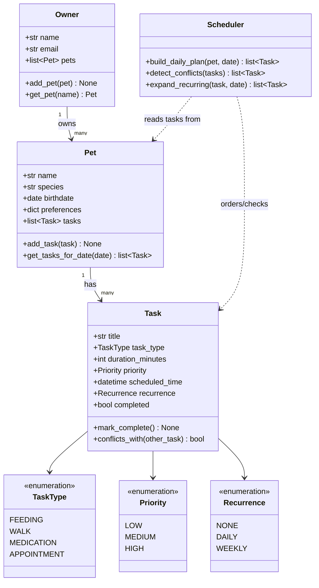

# PawPal+ Project Reflection

## 1. System Design

**a. Initial design**

**Three core user actions**

1. **Add a pet** — an owner registers a pet (name, species, birthdate, notes/preferences) so tasks can be attached to it.
2. **Schedule a care task** — an owner creates a task for a pet (feeding, walk, medication, or appointment) with a duration, priority, and optional recurrence, and the system checks it against the existing schedule for conflicts.
3. **View today's plan** — an owner requests the day's task list and the system returns tasks sorted/prioritized (and flags overdue or conflicting items) so the owner knows what to do next.

**Initial UML (draft)**

**Classes and responsibilities**

- `Owner` — holds owner identity and the collection of pets they manage; entry point for adding/looking up pets.
- `Pet` — holds pet identity/preferences and owns its list of `Task`s.
- `Task` — represents a single care item (feeding, walk, medication, appointment) with duration, priority, scheduled time, and recurrence; knows how to detect a time conflict with another task.
- `TaskType`, `Priority`, `Recurrence` — enumerations that constrain task fields to valid values instead of free-text strings.
- `Scheduler` — stateless logic that takes a pet's tasks and produces a prioritized, conflict-checked daily plan, and expands recurring tasks into concrete occurrences for a given date.

**Building blocks: attributes and methods**

- **`Owner`**
  - Holds: `name`, `email`, `pets` (list of `Pet`)
  - Does: `add_pet(pet)` — register a new pet under this owner; `get_pet(name)` — look up a pet by name
  - *Why:* `Owner` is the entry point into the system — every pet and task is reached by first going through an owner, which keeps multi-owner/multi-pet households possible later without redesigning the model.

- **`Pet`**
  - Holds: `name`, `species`, `birthdate`, `preferences` (dict, e.g. feeding times, walk style), `tasks` (list of `Task`)
  - Does: `add_task(task)` — attach a new care task to this pet; `get_tasks_for_date(date)` — filter this pet's tasks down to the ones relevant to a given day
  - *Why:* Tasks live on `Pet` (not `Owner`) because care needs are per-animal — a household with two pets needs independent schedules, not one shared list.

- **`Task`**
  - Holds: `title`, `task_type` (`TaskType`), `duration_minutes`, `priority` (`Priority`), `scheduled_time`, `recurrence` (`Recurrence`), `completed` (bool)
  - Does: `mark_complete()` — flip the task's completion state; `conflicts_with(other_task)` — detect whether this task's time window overlaps another task's
  - *Why:* `conflicts_with` lives on `Task` itself (rather than only in the scheduler) so any two tasks can be compared directly, which keeps conflict-checking logic reusable and testable in isolation.

- **`TaskType` / `Priority` / `Recurrence` (enums)**
  - Holds: fixed sets of valid values — `FEEDING`/`WALK`/`MEDICATION`/`APPOINTMENT`; `LOW`/`MEDIUM`/`HIGH`; `NONE`/`DAILY`/`WEEKLY`
  - Does: no behavior — they exist purely to constrain fields to valid values instead of free-text strings
  - *Why:* Using enums instead of strings prevents typos like `"hihg"` priority from silently breaking sorting or filtering logic.

- **`Scheduler`**
  - Holds: no persistent state — it's a stateless helper that operates on whatever `Pet`/`Task` data is passed in
  - Does: `build_daily_plan(pet, date)` — produce a prioritized, ordered plan for a day; `detect_conflicts(tasks)` — flag overlapping tasks; `expand_recurring(task, date)` — turn a recurring task into concrete dated occurrences
  - *Why:* Keeping `Scheduler` stateless means the same logic can run against any pet's tasks without risk of leftover state from a previous scheduling run leaking into the next one.

**b. Design changes**

The design changed twice while reviewing the skeleton in `pawpal_system.py`, before any logic was implemented:

1. **`Task.completed: bool` → `Task.completed_dates: set[date]`, plus a new `TaskOccurrence` class.** The original design gave a `Task` a single `completed` flag. That breaks for recurring tasks: a `DAILY` walk is one `Task` object, so marking it complete would either mark the entire series complete forever, or (if occurrences were copied per day) silently lose the state entirely once the copy went out of scope. The fix tracks completion per calendar date on the template, and introduces `TaskOccurrence` — a lightweight, ephemeral object (never stored) representing one dated instance of a `Task` for display in a daily plan, whose `completed`/`mark_complete()` delegate back to the template so there's one source of truth. `Scheduler` methods were updated to return/accept `TaskOccurrence` instead of `Task` (e.g. `build_daily_plan` returns `list[TaskOccurrence]`, `detect_conflicts` returns conflicting *pairs* rather than a flat list of tasks, since a single task can't be "a conflict" on its own).
2. **Added `id` fields to `Task` and `Pet`.** `Owner.get_pet` originally looked pets up by `name`, but two pets can plausibly share a name (e.g. two "Max"es in a household), which would make lookup ambiguous. Both `Pet` and `Task` now carry a `uuid`-based `id`, and `Owner.get_pet` takes `pet_id` instead of `name`.

A further edge-case pass added:

3. **`Task.recurrence_end_date` and `Pet.remove_task`.** A recurring task originally had no way to stop recurring (e.g., a 10-day course of medication) or be deleted once created; both are now explicit.
4. **Tie-break rule for equal-priority tasks.** `Scheduler.build_daily_plan` orders by `Priority` first, then alphabetically by title as the initial tie-break within a tier. (Later upgraded to a chronological tie-break by `start_time` — see the Advanced Priority Scheduling note in section 2a below.)
5. **Boundary conflicts are not conflicts.** `Task.conflicts_with` treats two occurrences that merely touch (one ends exactly when the other begins) as non-overlapping.
6. **Zero-duration tasks are rejected; midnight-rollover tasks span both dates.** `Task.__post_init__` raises if `duration_minutes <= 0`. A task whose `scheduled_time + duration` crosses midnight is considered to occur on both its start date and its rollover end date, so it appears on both days' plans.
7. **`build_daily_plan` excludes already-completed occurrences.** A finished walk shouldn't clutter today's plan.
8. **Empty state returns `[]`, never raises.** A pet with no tasks (or no occurrences for a given date) is a normal, valid result.
9. **Missed/overdue tasks get a recovery path.** Added `Scheduler.get_missed_tasks(pet, as_of)` to surface past, incomplete occurrences, and `Task.reschedule(new_scheduled_time)` so an owner can move a missed one-off task forward instead of it silently vanishing once its date passes.

A final change addressed a gap around owners with multiple pets:

10. **`TaskOccurrence` gained a `pet` field, and `Scheduler` gained `build_daily_plan_for_owner`.** Every existing `Scheduler` method operated on a single `Pet`, with no way to build one combined plan across all of an owner's pets. Rather than having a caller loop over `owner.pets`, call `build_daily_plan` per pet, and concatenate the results, `build_daily_plan_for_owner` merges every pet's occurrences *before* applying the not-completed filter, ordering, and time budget. This matters because those constraints are really about the *owner's* time, not any one pet's — concatenating already-built per-pet plans would apply the time budget separately per pet instead of across the owner's whole day, and would miss a real conflict like the owner being double-booked to walk two different dogs at the same time. `detect_conflicts` already took a flat `list[TaskOccurrence]` rather than `(pet, tasks)`, so it needed no change to support cross-pet conflicts — it just needed occurrences that carry `pet`, which is why that field was added and `expand_recurring` now takes `pet` as well (to stamp it on).

All of these were caught by treating the class skeleton as a design review step — asking "what happens when X is recurring / duplicated / missed / empty / shared across pets" before writing any method bodies — rather than discovering them mid-implementation.

---

## 2. Scheduling Logic and Tradeoffs

**a. Constraints and priorities**

`Scheduler` considers four constraints, in this order of precedence:

1. **Completion status.** `build_daily_plan`/`build_daily_plan_for_owner` drop any occurrence already marked complete for that date before anything else runs. A finished task has no scheduling relevance, so it's filtered first rather than just sorted last.
2. **Priority.** `HIGH`/`MEDIUM`/`LOW` is the primary sort key. This is the constraint an owner actually cares about day-to-day — "what's most important to not miss" — so it dominates ordering.
3. **Start time (chronological), as a deterministic tie-break.** When two tasks share a priority, something has to break the tie consistently so the plan doesn't reorder itself between runs. This started as an alphabetical-by-title tie-break (the simplest deterministic rule available at the time — see design change #4), then was upgraded to sort by `start_time` instead, as an Advanced Priority Scheduling extension: alphabetical order carries no real scheduling meaning (a task named "Ant grooming" isn't more urgent than "Zebra checkup"), whereas within a priority tier, "which one happens first" is a meaningful default. `tests/test_pawpal.py::test_build_daily_plan_orders_by_priority_then_start_time` deliberately uses titles alphabetized backwards from their times to prove the tie-break is time-based, not title-based.
4. **Time budget (optional).** If `time_budget_minutes` is supplied, it's applied last, after the list is already ordered — occurrences are accepted in priority order until the running total would exceed the budget, then the remaining (lower-priority) tail is dropped.

Conflict detection (`detect_conflicts`) is a separate, parallel constraint rather than baked into the ordering: it doesn't remove or reorder anything, it just reports overlapping pairs for the caller to surface. Priority and completion status change *what's in the plan*; conflicts are informational on top of the plan.

I ordered them this way because completion status is a hard filter (no ambiguity — a done task is done), priority is the one constraint with real, owner-defined meaning, and the tie-break/budget rules only need to be "reasonable and consistent," not "optimal" — see the tradeoff below.

**b. Tradeoffs**

The time-budget cutoff is a **greedy truncation, not a knapsack optimization**. Once the running total would exceed `time_budget_minutes`, `_finalize_plan` stops adding occurrences entirely (`break`), even if a later, shorter, lower-priority task would still fit in the remaining time. A true optimizer could pack more tasks into the same budget by skipping over ones that don't fit instead of stopping outright.

This tradeoff is reasonable here because the ordering is priority-first: by the time the budget is exhausted, everything already included is higher-priority than everything left out, and the alternative (skip-and-continue) could let a trivial low-priority task jump ahead of a skipped medium-priority one just because it happened to be smaller. For a personal pet-care planner, "the owner's most important tasks fit, in order, and the rest come with an explicit, honest cutoff" is more predictable and easier to reason about than a bin-packing result that quietly swaps in whatever combination maximizes task count.

`detect_conflicts` is a **plain O(n²) pairwise comparison (`itertools.combinations`), not a sweep-line algorithm**. An interval-scheduling sweep (sort by `start_time`, maintain a pruned "active" window) would cut this to O(n log n), but I asked an AI assistant for that alternative and decided not to adopt it: a pet owner's daily task list is realistically tiny (a handful of tasks across a couple of pets), so the asymptotic win never materializes, while the sweep's active-interval bookkeeping (especially preserving the existing same-task-id exclusion and the strict-overlap rule) is real complexity to introduce and re-verify for no practical benefit. `itertools.combinations` reads as "compare every pair," which is a closer match to how a person actually reasons about "did anything overlap" than a stateful sweep would be — here, more Pythonic/performant and more readable pointed in different directions, and readability won given the scale.

---

## 3. AI Collaboration

**a. How you used AI**

An AI coding assistant (Claude) was used across the whole lifecycle: brainstorming the initial UML and building-block breakdown, reviewing the class skeleton for edge cases before any logic existed, implementing the scheduling logic and its tests, drafting two of the stretch challenges (a "next available slot" finder and a missed-weekly-task auto-reschedule algorithm, the latter compared against a second model), and wiring the backend into the Streamlit UI. The most useful prompts weren't "implement X" requests — they were open-ended review/audit questions asked *after* a chunk of work looked done: "are there any edge cases that need to be considered at this stage?", "are there any opportunities for simplification or optimization?", and especially "are there any other features in the backend that are not exposed in the UI yet?" Each of those surfaced real gaps that a narrower implementation request never would have.

**b. Judgment and verification**

The clearest example is that last question above. After Challenge 1 (`find_next_available_slot`) and Challenge 5 (`auto_reschedule_missed_weekly`) were implemented, the AI had done everything the instructions literally asked for: the methods existed in `pawpal_system.py`, with passing tests, README documentation, and an `ai_interactions.md` write-up. By that narrow measure, the work was complete. But the AI never made the connection that a fully-implemented, fully-tested backend method is still useless to an actual user if nothing in `app.py` ever calls it — and it didn't flag that gap on its own initiative at any point, even while writing README sections describing the feature as if it were part of the product. The same thing had already happened earlier with `Pet.remove_task` (task deletion): implemented and tested in the backend, documented nowhere as missing from the UI, until directly asked.

I caught this by not treating "tests pass and README is updated" as equivalent to "the feature works end-to-end" — instead asking directly whether backend methods existed with no UI entry point. Verifying the answer was mechanical (grep every public method name against `app.py` to see which ones were never called), which is exactly the kind of check that should have happened automatically as part of "is this feature actually done," rather than needing to be requested separately. The pattern worth remembering: an AI assistant will faithfully implement the literal scope of what's asked, but won't necessarily notice that "implemented in the logic layer" and "usable by an owner clicking through the app" are two different bars — that seam has to be checked for explicitly, not assumed to be covered by the same pass that wrote the backend code.

---

## 4. Testing and Verification

**a. What you tested**

- What behaviors did you test?
- Why were these tests important?

**b. Confidence**

- How confident are you that your scheduler works correctly?
- What edge cases would you test next if you had more time?

---

## 5. Reflection

**a. What went well**

- What part of this project are you most satisfied with?

**b. What you would improve**

- If you had another iteration, what would you improve or redesign?

**c. Key takeaway**

- What is one important thing you learned about designing systems or working with AI on this project?
